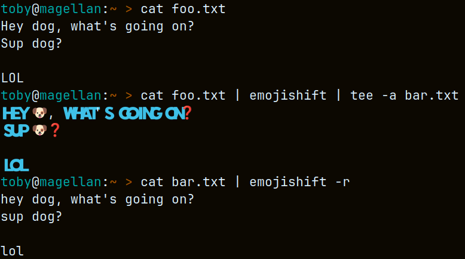

# emojishift

<b>A pipeable, command-line tool, for converting text to emoji, or emoji to text. 👍</b>

## Prerequisites

Prerequisite packages are already standard on most current Linux distributions 🖥️:
- <a href="https://github.com/13rac1/twemoji-color-font">SVG-OpenType</a> (or equivalent)
- <a href="https://github.com/python/cpython">Python 3.6+</a>

## Installation

Assuming you have prerequisites installed, simply add emojify to your $PATH, and ensure it is executable. 

For system-wide usage, copy to `/usr/local/bin`:
```
curl -O https://raw.githubusercontent.com/aetherbird/emojishift/main/emojishift
sudo mv emojishift /usr/local/bin
sudo chmod +x /usr/local/bin/emojishift
```

## Usage

```
usage: emojishift [-h] [-l] [-g] [-s] [-a] [-d] [-r] [-v]

emojishift: translate text to emoji, or emoji to text

options:
  -h, --help           show this help message and exit
  -l, --light, -1      light: letters and text only
  -g, --glyph, -2      glyph: glyph translations only
  -s, --standard, -3   standard: apply glyphs and letters
  -a, --alternate, -4  alternate: apply glyphs and alternate unicode
  -d, --deep, -5       deep: apply maximum glyphing
  -r, --reverse        reverse-translate from emoji to text
  -v, --version        show program's version number and exit
```

emojishift supports UNIX/Linux pipes: |.  For instance, to invoke emoji glyphing on file foo.txt:
```
cat foo.txt | emojishift
```

emojishift can also reverse translate, converting emojis to text:
```
cat emoji_filled_file.md | emojishift
```



## License

MIT
